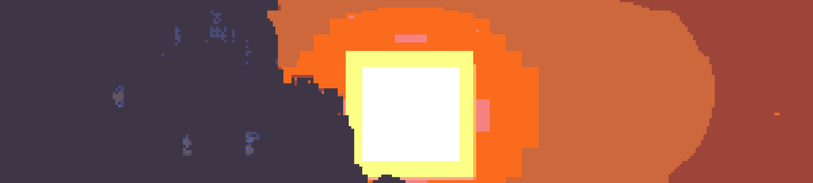
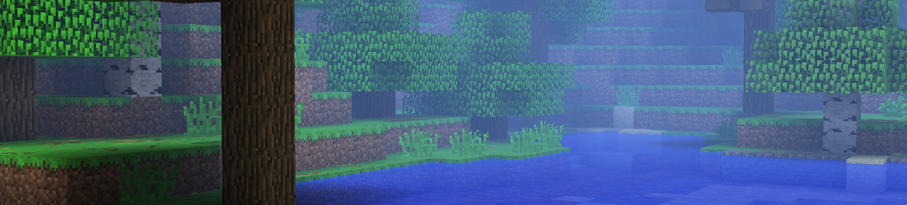

```wasm
Hey there, I'm Snorfield!

I'm a graphics and full stack programmer. Here's a few things about me:

- I enjoy being in nature, specifically forests.
- I read tons of books, some of my favorite include mystery novels, and of course, the Garfield comic strips.
- I do graphic design, as well as pixel art.
- Procedural art and cellular automata systems interest me greatly.
- I love applied mathematics

Some of my accomplishments include having several shaderpacks on modrinth with over twelve thousand downloads.
```
[](https://modrinth.com/shader/phial)
[](https://modrinth.com/shader/somber)
```
Languages I Use
├── C++
├── JavaScript
│   ├── Node.js
│   ├── Discord.js
│   └── Express.js
├── GDScript
├── HTML
│   └── CSS
├── GLSL
└── Scratch

┌──────────────────────────────┐
│         GitHub Stats         │
├──────────────────────────────┤
│ Stars Earned        │  12    │
│ Commits (1y)        │  289   │
│ PRs                 │  2     │
│ Issues              │  1     │
│ Contributed (1y)    │  5     │
├──────────────────────────────┤
│         Grade: C+            │
└──────────────────────────────┘

```


